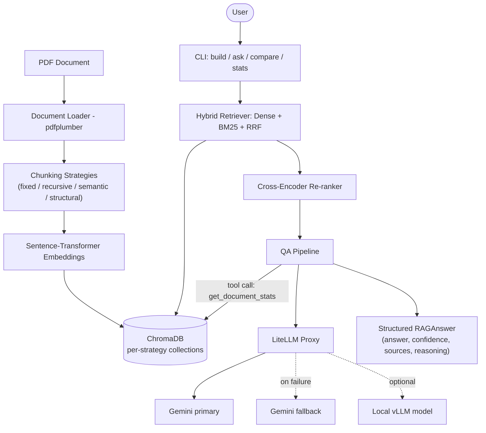
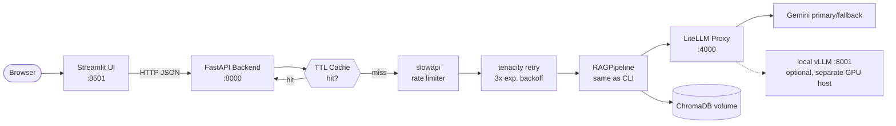

# RAG Document Assistant

A Retrieval-Augmented Generation (RAG) application for document Q&A, covering:
**Task 1** — an applied-AI RAG assistant (chunking, vector search, structured
output, tool calling, local model support), and **Task 2** — productionizing
it into a served application (web UI, async backend, caching, retries, rate
limiting, fallback models, Docker Compose).

## Table of Contents
- [Architecture](#architecture)
- [Features](#features)
- [Setup and Installation](#setup-and-installation)
- [Usage — CLI (Task 1)](#usage--cli-task-1)
- [Usage — Web App (Task 2)](#usage--web-app-task-2)
- [Reliability Design](#reliability-design)
- [Configuration](#configuration)
- [Known Limitations](#known-limitations)
- [Project Structure](#project-structure)

## Architecture

### Task 1 — Core RAG pipeline


### Task 2 — Production deployment


Three containers (`docker-compose.yml`): `litellm` (proxy), `backend`
(FastAPI), `ui` (Streamlit). The optional vLLM local-model server is
**not** included in Compose since it needs GPU passthrough — run it
separately with `scripts/serve_local_model.sh` and it becomes reachable
at `local-model` in the model dropdown.

## Features

**Task 1**
- 4 chunking strategies: fixed-size, recursive, semantic (embedding-based), structural (PDF-aware)
- ChromaDB vector store, one collection per strategy
- Hybrid search: dense (embeddings) + sparse (keyword overlap) fused via Reciprocal Rank Fusion
- Cross-encoder re-ranking (falls back to keyword overlap if the model is unavailable)
- **Structured JSON output** — every answer is a validated `RAGAnswer` (answer, confidence, sources, reasoning)
- **Tool calling** — the LLM can invoke `get_document_stats(strategy)` mid-conversation
- **Fallback model** — Gemini primary → Gemini fallback, configured in LiteLLM, with a third slot for a **local vLLM model**

**Task 2**
- FastAPI backend wrapping the same `RAGPipeline` used by the CLI
- Streamlit web UI talking to the backend over HTTP
- **Async request handling** (blocking pipeline calls run in a thread pool so the event loop stays responsive to concurrent requests)
- **In-memory TTL cache** (5 min) keyed on question+strategy+model — repeat questions return instantly
- **Retry** — 3 attempts with exponential backoff around the LLM call
- **Rate limiting** — 10 requests/minute per client IP on `/ask`
- **Graceful degradation** — persistent failures return HTTP 200 with a degraded, clearly-labeled answer instead of a 500
- **Docker Compose** — three services (litellm, backend, ui), independently buildable/scalable

## Setup and Installation

1. **Clone the repository and enter it.**

2. **Environment variables** — copy `.env.example` to `.env` and fill in:
   ```env
   GEMINI_API_KEY=your_api_key_here
   ```
   Get a free key at https://aistudio.google.com/apikey (no GCP project or
   billing required — this uses the direct Gemini API, not Vertex AI).

3. **Install dependencies:**
   ```bash
   uv venv && source .venv/bin/activate
   uv sync
   ```
   > Note: this project's dependencies changed during Task 2 work (added
   > fastapi/streamlit/slowapi/tenacity). If `uv sync` complains about a
   > stale lockfile, run `uv lock` once to regenerate it, then `uv sync` again.

4. **Place your PDF** in `rag_app/rag_docs/` and update `PDF_PATH` in
   `rag_app/config.py` if the filename differs. Any text-based PDF works —
   see [Known Limitations](#known-limitations) for scanned/image-only PDFs.

5. **Start the LiteLLM proxy** (separate terminal, stays running):
   ```bash
   uv run litellm --config rag_app/litellm_config.yaml
   ```

## Usage — CLI (Task 1)

### Build the vector index
```bash
python -m rag_app build --strategy recursive
```
Strategies: `fixed`, `recursive`, `semantic`, `structural`

### Ask questions
```bash
# Standard query
python -m rag_app ask "Who is Rama?"

# With tool calling enabled
python -m rag_app ask "How many chunks are in the recursive strategy?" --enable-tools

# Target a specific model (gemini-primary / gemini-fallback / local-model)
python -m rag_app ask "Who is Rama?" --model local-model
```

### Compare strategies / view stats
```bash
python -m rag_app compare
python -m rag_app stats
```

### Local model via vLLM
```bash
./scripts/serve_local_model.sh Qwen/Qwen2.5-1.5B-Instruct
```
This starts an OpenAI-compatible server on port 8001, matching the
`local-model` entry already present in `rag_app/litellm_config.yaml`.
**Hardware note:** a GPU with ≥8GB VRAM is recommended; CPU-only inference
works but is slow. This path is implemented and configured but has not
been run end-to-end on this machine (no GPU available during development)
— verify on your own hardware before relying on it.

## Usage — Web App (Task 2)

### Local dev (no Docker)
```bash
# Terminal 1: proxy (as above)
uv run litellm --config rag_app/litellm_config.yaml

# Terminal 2: backend
uv run uvicorn service.api:app --reload --port 8000

# Terminal 3: UI
uv run streamlit run ui/app.py
```
Open http://localhost:8501

### Docker Compose (all three services)
```bash
docker compose up --build
```
- UI: http://localhost:8501
- Backend API docs: http://localhost:8000/docs
- LiteLLM proxy: http://localhost:4000

Build the vector index once before first use (from your host, since
`chroma_db/` is a mounted volume):
```bash
python -m rag_app build --strategy recursive
```

## Reliability Design

| Requirement | Implementation |
|---|---|
| Retry | `tenacity`, 3 attempts, exponential backoff (`service/api.py::_ask_with_retry`) |
| Rate limiting | `slowapi`, 10 req/min per IP on `/ask`, 30/min on `/stats` |
| Fallback model/provider | LiteLLM `router_settings.fallbacks`: gemini-primary → gemini-fallback (config-level, not app-level) |
| Error handling / graceful degradation | `/ask` never raises past a well-formed `RAGAnswer`; on unrecoverable failure returns HTTP 200 with `confidence=0.0` and a `reasoning` field explaining what happened |
| Caching | In-memory TTL cache (5 min), keyed on question+strategy+model; documented upgrade path to Redis for multi-instance deployments |
| Async/concurrency | FastAPI async routes; blocking pipeline calls dispatched via `asyncio.to_thread` so one slow request doesn't block others |

**Tested (see verification below):** health/stats endpoints, cache hit/miss
behavior, rate-limit threshold (429 after 10 requests), input validation
(422 on empty question), and the degradation path (a forced internal
exception correctly returns HTTP 200 with a clear `reasoning` message
instead of crashing) — all verified with FastAPI's `TestClient` against
mocked pipeline internals. **Not yet tested:** the full pipeline against a
real, running LiteLLM proxy + populated ChromaDB (needs your API key and a
built index — see verification checklist in `SUBMISSION.md`).

## Configuration

Edit `rag_app/config.py`:

| Parameter | Default | Description |
|-----------|---------|-------------|
| `LITELLM_PROXY_URL` | `http://localhost:4000` (env-overridable) | LiteLLM proxy endpoint — set to `http://litellm:4000` automatically inside Docker Compose |
| `LITELLM_MODEL_NAME` | `gemini-primary` | Model alias for proxy |
| `CHROMA_PERSIST_DIR` | `../chroma_db` | ChromaDB storage path |
| `PDF_PATH` | `rag_docs/ramayana.pdf` | PDF document path — change to your own document |
| `CHUNKING_STRATEGIES` | see config | Parameters per strategy |
| `RRF_K` | `60` | Reciprocal Rank Fusion constant |
| `RERANK_TOP_K` | `5` | Top results after re-ranking |
| `TEMPERATURE` | `0.7` | LLM temperature |

## Known Limitations

- **Image-only / scanned PDFs are not supported.** No OCR is implemented;
  `pdfplumber` returns 0 characters for pages with no text layer, and those
  pages are silently skipped. Use a text-based PDF.
- **Tool calling supports one tool** (`get_document_stats`). The
  function-calling loop is generic and can be extended with more tools.
- **Local vLLM model path is configured but not hardware-verified** — no
  GPU was available during development; the LiteLLM config entry and CLI
  flag are correct and complete, but you should confirm on your own machine.
- **BM25/sparse corpus is rebuilt ad hoc** from the raw document text at
  query time rather than reusing the exact indexed chunk boundaries — dense
  retrieval (the primary signal) uses the real indexed chunks with full
  metadata; the sparse signal is a coarser approximation. This is a known
  simplification, not a crash risk.
- **Cache is in-memory and per-process** — restarting the backend or
  running multiple replicas means no shared cache. For multi-instance
  deployment, swap `TTLCache` in `service/api.py` for Redis.
- **Confidence scores are model self-reported**, not independently
  validated against retrieval quality.

## Project Structure

```
.
├── rag_app/                  # Task 1: core RAG pipeline (unchanged CLI entry point)
│   ├── __main__.py           # CLI: build / ask / compare / stats
│   ├── config.py
│   ├── document_loader.py
│   ├── qa_pipeline.py        # RAGPipeline + RAGAnswer (structured output, tool calling)
│   ├── vector_store.py
│   ├── litellm_config.yaml   # gemini-primary / gemini-fallback / local-model
│   ├── chunking/              # 4 strategies
│   ├── retrieval/             # hybrid search + re-ranking
│   └── rag_docs/              # place your PDF here
├── service/
│   └── api.py                 # Task 2: FastAPI backend (cache, retry, rate limit)
├── ui/
│   └── app.py                  # Task 2: Streamlit web UI
├── scripts/
│   └── serve_local_model.sh    # vLLM local model launcher
├── Dockerfile.litellm           # proxy container
├── Dockerfile.backend           # FastAPI container
├── Dockerfile.ui                 # Streamlit container
├── docker-compose.yml             # wires all three together
├── SUBMISSION.md                   # deliverable checklist mapped to the rubric
└── pyproject.toml
```
